## Welcome to my Git profile!

Hi, I'm **José Salas**, a Data Engineer with a solid background in **Supervised and Unsupervised Learning**, along with experience in fine-tuning existing neural networks for object detection. Currently, I am focused on building reliable data pipelines, orchestrating cloud migrations with **Databricks** and **Azure**, and continuously expanding my **DevOps** skills through **CI/CD** and deployment practices.

* **Connect with me:** If you want to chat about data or just say hi, you can find me on **[LinkedIn](https://www.linkedin.com/in/josesalasbiedma/))**.
* **Curious how I orchestrate data and tech day-to-day?** Check out my **portfolio** here: **[Web](https://web-build-jsb.netlify.app/)**

 

  

